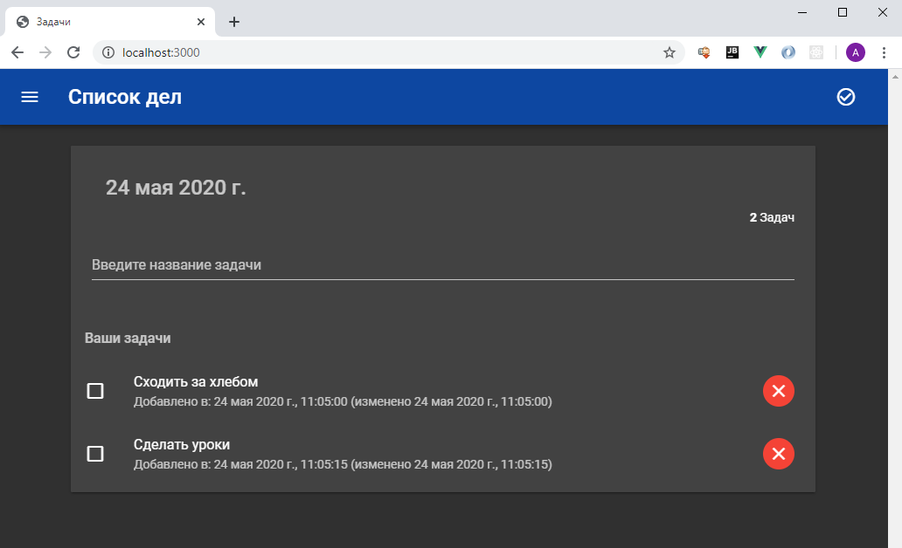

# Todo App
Третье приложение написанное в рамках учебного курса ["Node JS. Практический курс. (Mongo, GraphQL, MySQL, Express)"](https://www.udemy.com/course/nodejs-full-guide/).

Представляет из себя todo-список задач, использующий в качестве хранилища данных СУБД MySQL. В приложении реализовано GraphQL API для получения/добавления/изменения/удаления задач. Клиентская часть реализована на Vue.js.

# GraphQL API

Получение списка задач:

```
query {
    getTodos {
      id, title, done, createdAt, updatedAt
    }
}
```

Добавление новой задачи:

```
mutation {
    createTodo(todo: {title: "название"}) {
        id, title, done, createdAt, updatedAt
    }
}
```

Отметить задачу как выполненную:

```
mutation {
    completeTodo(id: <id>) {
        updatedAt
    }
}
```

Удалить задачу:

```
mutation {
    deleteTodo(id: <id>)
}
```

# Example
